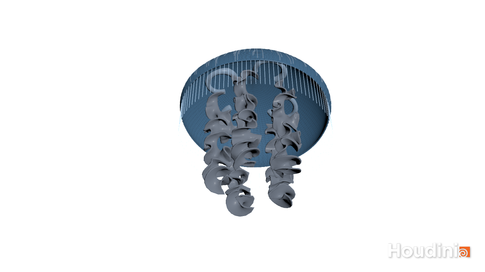
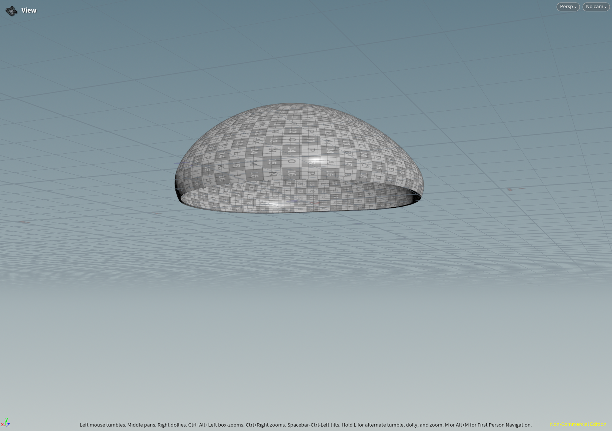
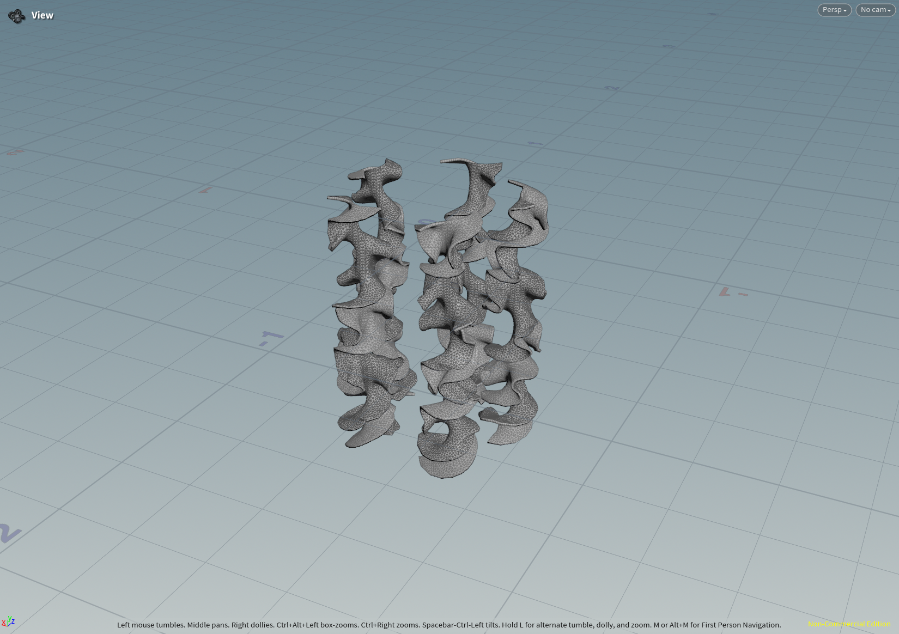
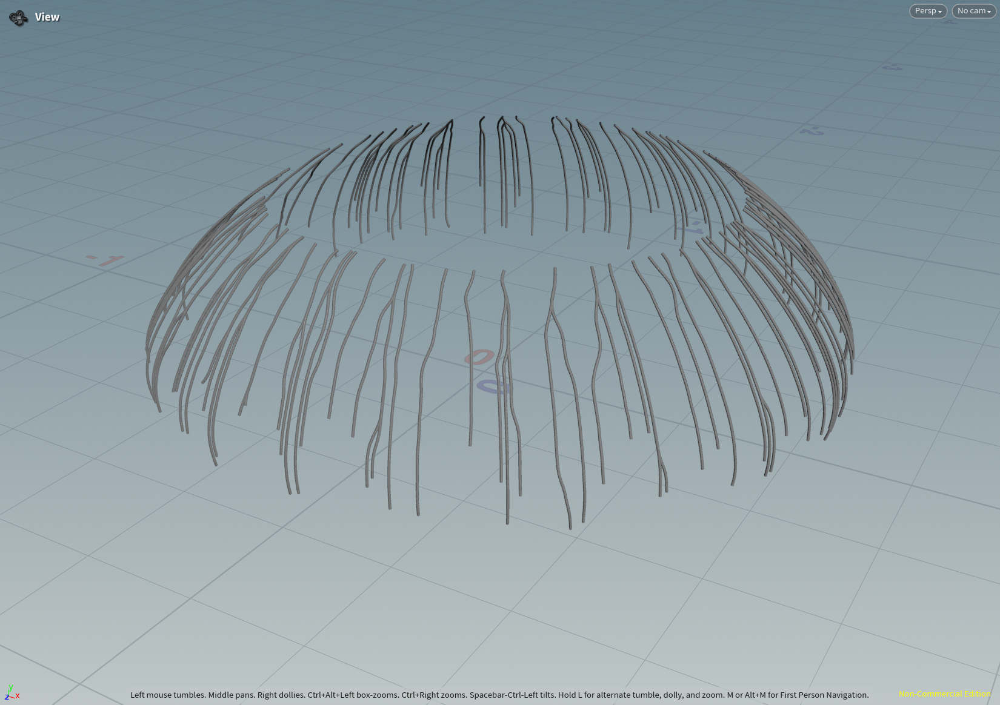
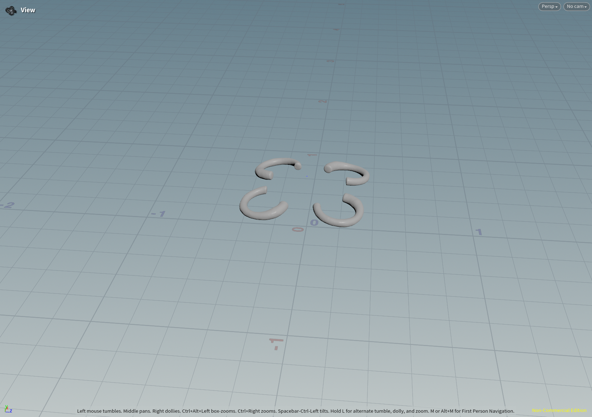

# Procedural Jellyfish

## Video

## Image

## Project Description

I made a procedural jeffyfish using Houdini. The main parts of the jellyfish is as following.

### Bell

Modeled the bell by drawing a line and then rotate it around the y-axis to get the mesh. And then adding some noise to deform it.

### Arms

The arms are started from a grid. By adding noise to bend it and twist it, it's not hard to get the arms.

### Veins

I sampled two parts of vertices on the bell, and then use the Find Shortest Path Node to generate the veins.

### Organs

Organs are simplied modeled by sweep a curve with a circle.

### Tentacles

To get the tentacles, I draw the lines first. Then, point the line to a group of target vertices and finally adding hair simulation to them.

